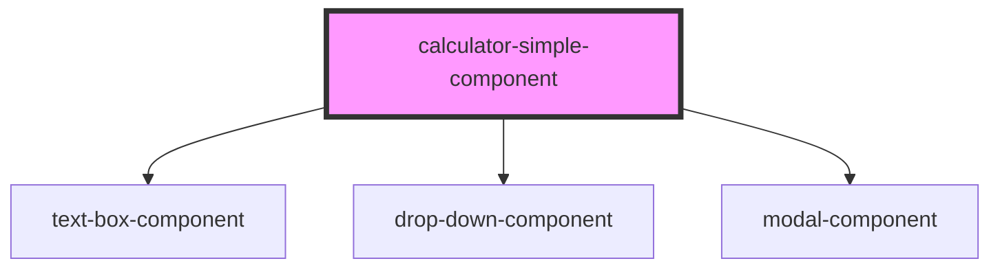

# my-component

<!-- Auto Generated Below -->

## Properties

| Property       | Attribute        | Description | Type     | Default     |
| -------------- | ---------------- | ----------- | -------- | ----------- |
| `button1Label` | `button-1-label` |             | `string` | `''`        |
| `button2Label` | `button-2-label` |             | `string` | `''`        |
| `type`         | `type`           |             | `string` | `'text'`    |
| `value`        | `value`          |             | `string` | `undefined` |

## Events

| Event      | Description | Type               |
| ---------- | ----------- | ------------------ |
| `button1`  |             | `CustomEvent<any>` |
| `button2`  |             | `CustomEvent<any>` |
| `onChange` |             | `CustomEvent<any>` |
| `onClick`  |             | `CustomEvent<any>` |
| `onInput`  |             | `CustomEvent<any>` |

## Methods

### `open() => Promise<void>`

#### Returns

Type: `Promise<void>`

## Dependencies

### Depends on

- [text-box-component](../text-box-component)
- [drop-down-component](../drop-down-component)
- [modal-component](../modal-component)

### Graph

----------------------------------------------

*Built with [StencilJS](https://stenciljs.com/)*
