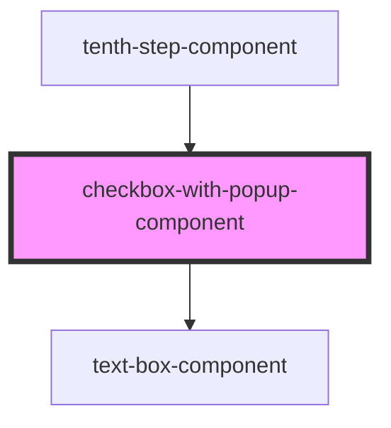

# checkbox-with-popup-component

<!-- Auto Generated Below -->

## Properties

| Property | Attribute | Description | Type     | Default  |
| -------- | --------- | ----------- | -------- | -------- |
| `id`     | `id`      |             | `string` | `''`     |
| `text`   | `text`    |             | `string` | `''`     |
| `type`   | `type`    |             | `string` | `'text'` |

## Events

| Event     | Description | Type               |
| --------- | ----------- | ------------------ |
| `onClick` |             | `CustomEvent<any>` |

## Methods

### `show() => Promise<void>`

#### Returns

Type: `Promise<void>`

## Dependencies

### Used by

 - [tenth-step-component](../tenth-step-component)

### Depends on

- [text-box-component](../text-box-component)

### Graph

----------------------------------------------

*Built with [StencilJS](https://stenciljs.com/)*
