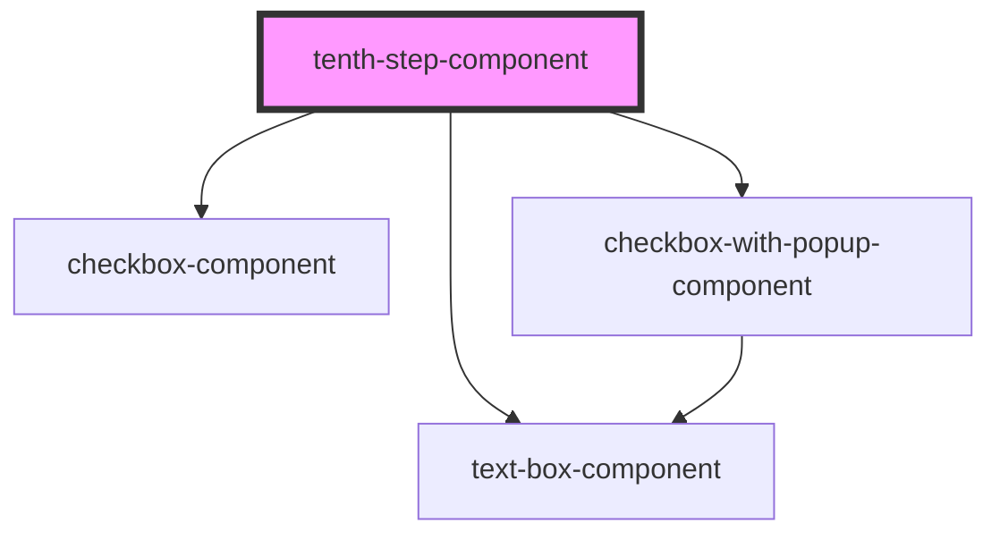

# tenth-step-component

<!-- Auto Generated Below -->

## Properties

| Property | Attribute | Description | Type     | Default |
| -------- | --------- | ----------- | -------- | ------- |
| `text`   | `text`    |             | `string` | `""`    |

## Dependencies

### Depends on

- [checkbox-component](../checkbox-component)
- [checkbox-with-popup-component](../checkbox-with-popup-component)
- [text-box-component](../text-box-component)

### Graph

----------------------------------------------

*Built with [StencilJS](https://stenciljs.com/)*
