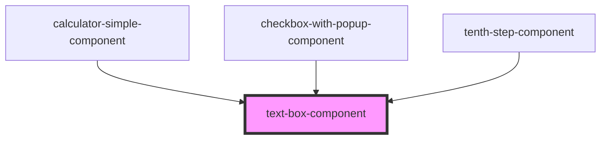

# my-component

<!-- Auto Generated Below -->

## Properties

| Property      | Attribute     | Description | Type      | Default     |
| ------------- | ------------- | ----------- | --------- | ----------- |
| `id`          | `id`          |             | `string`  | `''`        |
| `label`       | `label`       |             | `string`  | `''`        |
| `placeholder` | `placeholder` |             | `string`  | `''`        |
| `required`    | `required`    |             | `boolean` | `false`     |
| `type`        | `type`        |             | `string`  | `'text'`    |
| `value`       | `value`       |             | `string`  | `undefined` |

## Events

| Event            | Description | Type               |
| ---------------- | ----------- | ------------------ |
| `inputValidated` |             | `CustomEvent<any>` |

## Dependencies

### Used by

 - [calculator-simple-component](../calculator-simple-component)
 - [checkbox-with-popup-component](../checkbox-with-popup-component)
 - [tenth-step-component](../tenth-step-component)

### Graph

----------------------------------------------

*Built with [StencilJS](https://stenciljs.com/)*
